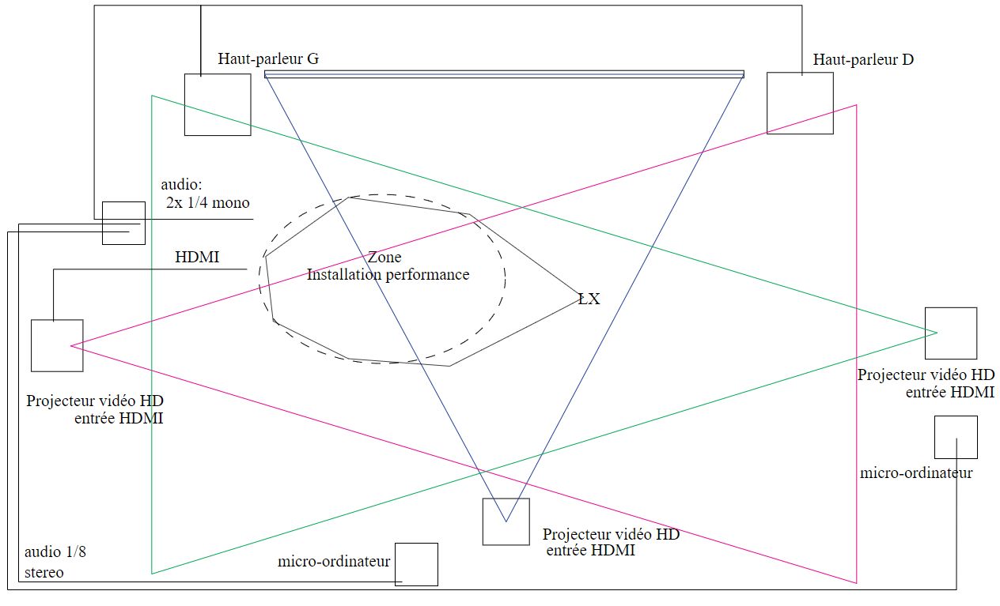

# Titre
*3 minutes*
# Créateur créatrice
- **Naoufal Bensaiad**
- **Jérémie Lévesque**
- **Samuel Poulin**
# La façon dont le thème du temps est exploité dans la création
Le temps exploiter dans la création nous permet de vivre 3 minutes dans 2 vies différentes, une heureuse et une malheureuse, pour nous sensibiliser a l'intimidation qui est le thème principal de l'histoire.
# L'ambiance
Il y a 2 ambiances différentes dans l'oeuvre, une heureuse où on y joue au ballon chasseur dans un gymnase et une autre obscure et malheureuse où l’on y vit la vie d'une personne intimidée coincée dans un casier.
# L'installation en cours dans les studios

Source : https://tim-montmorency.com/2022/projets/3-minutes/docs/web/index.html
# Le schéma de l'installation prévue

Source : https://github.com/tim-montmorency/66B-modele_de_projet/blob/main/docs/preproduction/medias/o3_plantation.svg
# Ce qui sera attendu de vous, en tant qu'interacteur.trice, lorsque vous ferez l'expérience de l'installation
Il sera attendu de nous de jouer au ballon chasseur grâce à un casque de réalité virtuelle pendant 3 minutes et de par la suite rentrer dans un casier où l’on y vivra la vie de l'intimidé pendant 3 autres minutes pour nous sensibiliser a l'intimidation.
 
# 3 cours du programme qui vous semblent incontournables pour avoir les compétences pour créer ce projet
1. Le premier cours qui nous semble incontournable est le cours de modélisation 3D , grâce à ce cours il serait possible de crée un environnement en réalité virtuelle comme le gymnase où il y a le jeu de ballon chasseur.

2. Le deuxième cours qui nous semble nécessaire est le cours de conception sonore qui nous permettrait de créer un environnement sonore qui nous submergerait dans les deux vies de l'oeuvre.

3. Le troisième est le cours de réalité virtuelle qui nous permettrait d'intégrer nos objets 3D dans le monde heureux et de créer le jeu de ballon chasseur.  
