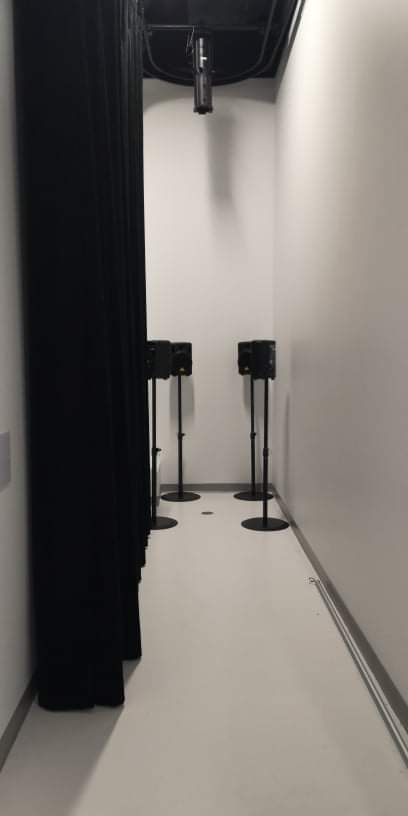
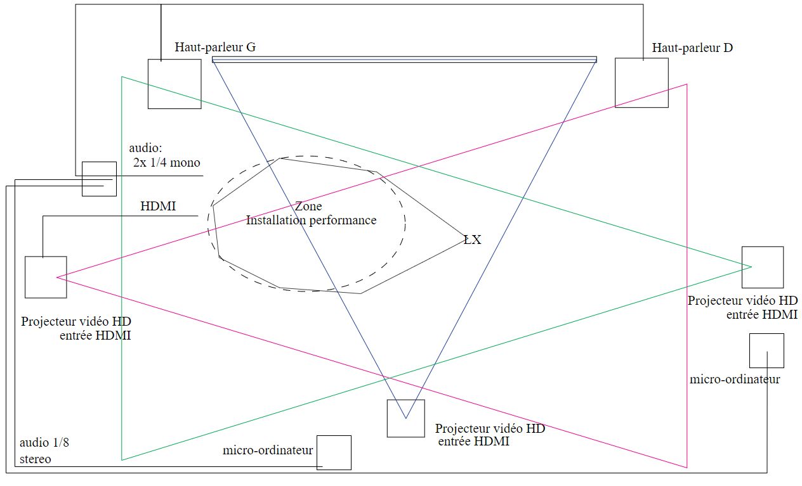

# titre
3 minutes
# créateur créatrice
- **Naoufal Bensaiad**
- **Jérémie Lévesque**
- **Samuel Poulin**
# la façon dont le theme du temps est exploiter dans la création
Le temps exploiter dans la création nous permet de vivre 3 minutes dans 2 vies diferentes, une heureuse et une malheureuse, pour nous sensibiliser a l'intimidation qui est le thème principal de l'histoire.
# l'ambiance
Il y a 2 ambiances différente dans l'oeuvre, une heureuse ou on y joue au ballon chasseur dans un gimnase et une autre sombre et malheureuse où on y vit la vie d'une personne intimidé coincé dans un casier
# l'installation en cours dans les studios (photos a l'appui)

https://tim-montmorency.com/2022/projets/3-minutes/docs/web/index.html
# le schéma de l'installation prévue (insérer le schéma de plantation avec la source)

https://github.com/tim-montmorency/66B-modele_de_projet/blob/main/docs/preproduction/medias/o3_plantation.svg
# ce qui sera attendu de vous, en tant qu'interacteur.trice, lorsque vous ferez l'expérience de l'installation
Il sera attendu de nous de jouer au ballon chasseur grâce a un casque de réalité virtuelle pendant 3 minutes et de part la suite rentrer dans un casier où on y vivra la vie de l'intimidé pendant un autre 3 minutes pour nous sensibiliser a l'intimidation 
# 3 cours du programme qui vous semblent incontournable pour avoir les compétences pour créer ce projet
Le premier cours qui nous semble incontournable est le cours de modélisation 3D que nous allons avoir a la 3e session, grâce a ce cours il serait possible de crée un environnement en réaliter virtuelle comme le gimnase où il y a le jeu de ballon chasseur. Le deuxième cours qui nous semble nécessaire est le cours de conception sonor qui nous permettrait de créer un environnement sonor qui nous submergerait dans les deux vies de l'oeuvre. le troisième est le cours de réalitée virtuelle qui nous permettrait d'intégrer nos objets 3D dans le monde heureux et de créer le jeu de ballon chasseur.   
