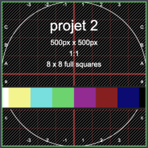
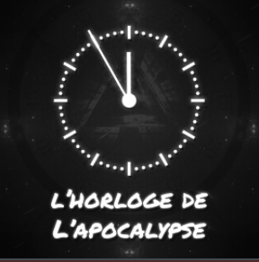
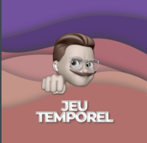
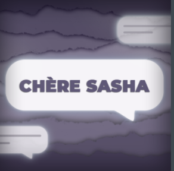
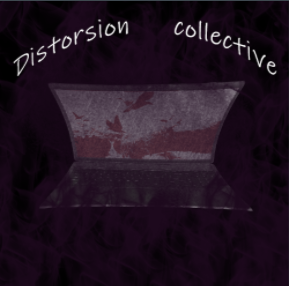

## Mes projets favoris

| 1. 3 minutes                 | J'ai choisi de mettre le projet "3 minutes" à la première place, car il est pour moi le projet qui respecte le plus le thème du temps. L'idée d'utiliser le thème du temps en démontrant que 3 minutes peut sembler courte dans une situation et dans une autre très longue. Aussi j'aime bien l'idée de faire le projet en réalité virtuel, le fait d'utiliser le casque de réalité virtuel permet d'accentuer la pression de la scène d'intimidation. C'est pour cela que je le mets à la première place.                             |      |
|------------------------------|-----------------------------------------------------------------------------------------------------------------------------------------------------------------------------------------------------------------------------------------------------------------------------------------------------------------------------------------------------------------------------------------------------------------------------------------------------------------------------------------------------------------------------------------|-----------------------------------------|
| 2. L'horloge de l'apocalypse | J'ai choisi de mettre le projet de "L'horloge de l'apocalypse" à la deuxième place, car il est pour moi le projet qui senbilise le plus sur l'impact de l'Humain. J'adore l'idée d'utiliser un concept de "L'horloge de l'apocalypse" ,que je ne connaissais pas auparavant, pour démontrer les conséquences de l'Humain. Aussi j'ai trouvé ingénieux de leur part d'utiliser une horloge et ses aiguilles pour ajouter de l'interactivité. C'est pour cela que je le mets à la deuxième place.                                         |      |
| 3. Jeux temporel             | J'ai choisi de mettre le projet du "Jeux temporel" à la troisième place, car il est pour moi le projet le plus divertissant. À la visite, je m'étais directement dirigé vers le projet car la borne m'intéressait beaucoup. Pendant la visite, j'ai pu comprendre la complexiter de se projet. Je ne pensais pas que se projet demandait autant d'efforts et de connaissances. Cette oeuvre m'a donné l'envie de continuer le programme pour me rendre à se projet.  C'est pour cela que je le mets à la troisième place.               |  |
| 4. Chère Sasha               | J'ai choisi de mettre le projet de "Chère Sasha" à la quatrième place, car il démontre un sujet très important, qui est l'acceptation et la dépression, en incorporant le thème du temps. Le projet inclue beaucoup d'interactivité et j'adore sa, mais je ne pense passer beaucoup de temps dedans. Les autres je sais que je vais les expérimenters plusieurs fois et avec mes amis, mais celui là je pense que je vais le faire 1 fois et après je vais passer à d'autre chose. C'est pour cela que je le mets à la quatrième place. |    |
| 5. Chronaufrage              | J'ai choisi de mettre le projet "Chronaufage" à la cinquième place, car je ne comprends pas vraiment le projet. Je trouve le projet extrêmement beau, les peintures demande beaucoup de talent, mais j'ai peur qu'ils n'arrivent pas à finir le projet. Aussi je ne comprends pas vraiment le lien avec le temps.C'est pour cela que je le mets à la cinquième place.                                                                                                                                                                   |        |
| 6. Distorsion collective     | Distorsion collective est un projet qui semble très intéressant, mais comme nous n'avons aucune ou presque aucune information. Pour cela, il est difficile d'aimer ce projet, aussi j'aurais aimé avoir une vidéo explicative du projet. Même si le projet à une très bonne idée, il est original et démontre les conséquences des cours en ligne, je pense que pour l'instant le projet mériterait la dernière place.                                                                                                                  |      |

Source:https://tim-montmorency.com/2022/index.html
