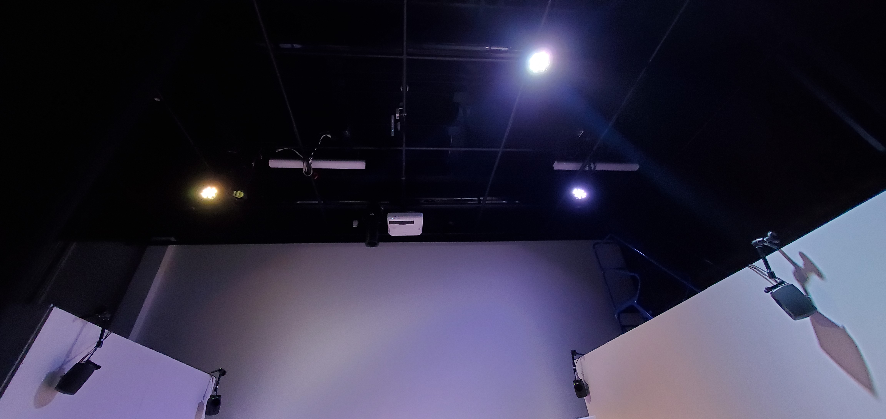

## Titre
*Chère Sasha*

### Les créateurs sont 
- **Trish Nguyen**
- **Angelina De Silva Jeca**
- **Karine Cormier**
- **Sabrina Kayani.**

# Les créateurs ont exploité le thème du temps en démontrant les deux vies de Sasha et comment cela affecte sa santé mentale. 

# Comment l'ambiance est-elle ?
L'ambiance est pour le côté de la chambre de Sasha adolescente désordonnée, froide, dépressive,sombre et pour le côté adulte de la chambre de Sasha une ambiance heureuse, colorée, douce et confortable.

# Voici l'installation en cours dans les studios  
Source : https:https://tim-montmorency.com/2022/projets/Chere-Sasha/docs/web/index.html

# Le schéma de l'installation prévue 
Source : https://tim-montmorency.com/2022/projets/Chere-Sasha/docs/web/preproduction.html

# Ce qui est prévu du téléspectateur est
Le téléspectateur va interagir avec le décor de deux chambres différentes pour comprendre comment Sasha était-elle adolescente et adulte. Plusieurs objets interactifs et narratifs seront à la disposition des téléspectateurs comme les journaux, la poubelle et un téléphone cellulaire. Aussi nous allons pouvoir laisser notre trace en écrivant un message d'encouragement à Sasha qui sera projeté sur le mur.

# 3 cours du programme qui vous semblent incontournables pour avoir les compétences pour créer ce projet
1. Premièrement, le cour "Conception Sonore" a aidé les élèves en ce qui concerne la création de la bande sonore.

2. Deuxièmement, le cour ""Intégration Web"" a aidé les élèves en ce qui concerne le CSS. Ils ont eux besoin de CSS dans la création de l'interface du téléphone cellulaire de Sasha adolescente.

3. Troisièmement, le cour ""Conception Vidéo"" a probablement aidé les élèves en ce qui concerne la conception de l'animation de la conclusion. Ils ont utilisé l'application  <<DaVinci Resolve>> qui nous est appris dans le cour de  <<Conception Vidéo>>.   
