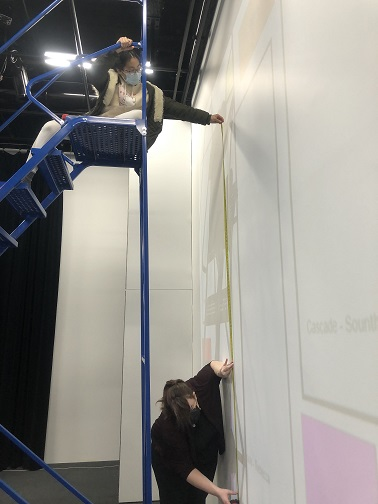
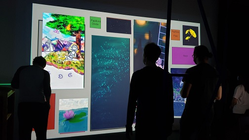

# titre
*Chronaufrage*
# créateur créatrice
- **Maloney Khim**
- **Sounthida Kong**
- **Olivier Lalonde**
- **Rebecca Pilotte**
- **Émilie Fontaine**
# la façon dont le theme du temps est exploiter dans la création
Le temps intéragie avec le personnage dans les tableau. Le personnage dans les tableau est dans une certaine situation et, dépendamment de où nous somme placer devant les tableau, la vitesse des évenement s'accélere stressant le personnage des tableau. Dans le dernier tableau, le personnage n'est plus influencer par nous. 
# l'ambiance
L'ambiance varie des tableaux, dans le premier tableau il y a de la pluie, dans le deuxième tableau il y a une cascade, dan le troisième tableau il y beaucoup d'eau puisque le personnage se noie et dans le dernier tableau c'est très calme et coloré.
# l'installation en cours dans les studios (photos a l'appui)

Lien vers les images **→** https://tim-montmorency.com/2022/projets/Chronaufrage/docs/web/index.html
# le schéma de l'installation prévue (insérer le schéma de plantation avec la source)

Lien vers l'image → https://github.com/Blobduckies/Chronaufrage/blob/main/docs/preproduction/medias/plan_technique.png
# ce qui sera attendu de vous, en tant qu'interacteur.trice, lorsque vous ferez l'expérience de l'installation
Nous entrons dans un musé avec 4 grand tableaus où on peut y voir le personnage de l'histoire. Les visiteurs du musée s'avance vers les oeuvres et découvre qu'il est possible d'intéragire avec eux, a travers des tableaux il y a une histoire avec le personnages des tableaux qui est raconté.
# 3 cours du programme qui vous semblent incontournable pour avoir les compétences pour créer ce projet
Premièrement, le cours d'espace intéractif pourrait permettre d'apprendre comment détecter qu'une personnage est devant et bouge devant les tableaux et de les rendres intéractif dépendamment de la position des personnes. Deuxièmement, nous pensons qu'il faudrait le cours d'animation 2D pour réaliser les oeuvres en vectoriel sur illustrator et de garder la qualité quand placer sur les tableau et de realiser une animation 2D grâce a after effect. Troisiémement , il faudrait le cours de conception sonore pour submerger les personnes intéragissant avec les oeuvres

