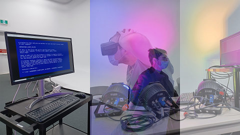
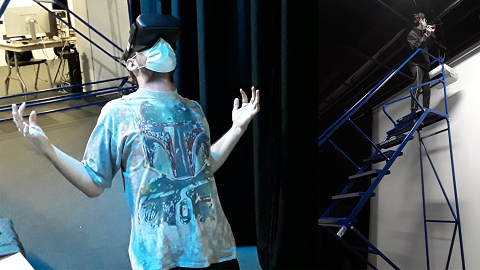

# Titre
*Distorsion collective*
# Créateur créatrice
- **William Dubois**
- **Ghislain Lacombe**
# La façon dont le thème du temps est exploité dans la création
De plus en plus que l'histoire avance, de pire en pire la situation est. Au tout début, le personnage est enthousiaste de commencer ses cours en lignes sauf que de plus en plus les journées passent, de plus en plus il se sent étouffé par les travaux.
# L'ambiance
L'ambiance au tout début est calme et relaxe, l'histoire se déroule à 4 endroits, dans le grand studio au tout début, le grand studio est bleu avec de la musique relaxante. Le deuxième endroit est la chambre le matin ou il y a son ordinateur pour rejoindre le Zoam de classe et communiquer avec son professeur. Le troisième endroit est la salle a manger où mangent ses céréales. Le quatrième endroit est le soir dans son salon où le personnage regarde la télévision. Tous les endroits deviennent de plus en plus étranges au fil du temps (ex: des objets qui coller au plafond ou des sons étranges et perturbants).
# L'installation en cours dans les studios  

Source : https://tim-montmorency.com/2022/projets/Distorsion-collective/docs/web/index.html
# Le schéma de l'installation prévue 

Source : https://tim-montmorency.com/2022/projets/Distorsion-collective/docs/web/preproduction.html
# Ce qui sera attendu de vous, en tant qu'interacteur.trice, lorsque vous ferez l'expérience de l'installation
Il sera attendu de nous de rentrer dans une pièce bleue où il y aura un casque de réalité virtuelle que nous allons mettre sur notre tête. Une fois dans le jeu, nous sommes dans la chambre du personnage qui commence ses cours Zoam en lignes et on parle avec le professeur qui explique les devoirs. Par la suite, la scène change et nous mangeons un bol de céréales dans une cuisine. Ensuite la scène change et nous écoutons la télévision dans un salon.L'est trois dernières étapes recommence tout le le long de l'histoire.

# 3 cours du programme qui vous semblent incontournables pour avoir les compétences pour créer ce projet
1. Le premier cours qu'il faudrait pour réaliser le projet serait le cours de modélisation 3D pour réaliser le décor dans la réalité virtuelle pour rendre le plus réaliste possible l'expérience.

2. Le deuxième cours serait le cours de réalité virtuelle. En effet, pour intégrer les différents objets réalisez dans le cours de modélisation 3D.

3. Le troisième cours de conception sonore pour réaliser les sons étranges qui viennent déstabiliser le personnage.
