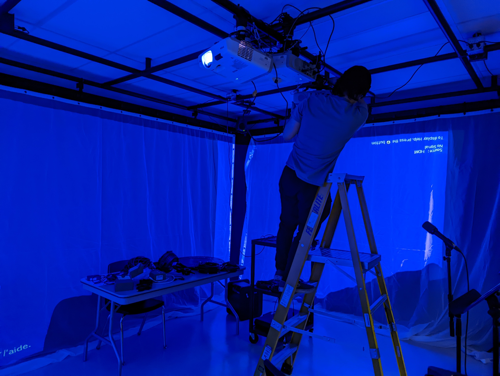

## Titre
*L'horloge de l'apocalypse*

### Quels sont les créateurs ?
1. **Maxime Sabourin**
2. **Louis-Philippe Gravel**
3. **Alexis Lacasse**
4. **Tristan Girard-Montpetit**
5. **Maxime De Falco**

# Comment les créateurs ont exploité le thème du temps ?
Ils veulent démontrer l'impact de l'humain au niveau social politique et environnemental tout au long de l'humanité à travers le concept de l'horloge de l'apocalypse. Ce concept créé en 1947 consiste à dénoncer le danger qui pèse sur l'humanité du fait des menaces nucléaires, écologiques et technologiques. Elle amène le concept que minuit serait la fin du monde et qu’une heure du matin serait le début de l'humanité.

# Quelle est l'ambiance du projet ?
Chaque moment dans l'histoire aura une ambiance différente et une scène différente. La première scène l'ambiance est très calme, sécuritaire et la deuxième scène a ambiance est plutôt paradisiaque.  La troisième scène à une ambiance préhistorique et caverneuse et la quatrième scène à une ambiance hivernale. La cinquième scène à une ambiance médiévale, la sixième scène à une ambiance de renaissance et la septième ambiance elle est industrielle et menaçante. La huitième scène l'ambiance est moderne et mystérieuse, la neuvième scène à une ambiance militaire, la dixième scène à une ambiance sombre, lourde et malheureuse. Finalement, la dernière scène à une ambiance infernale et sinistre.

# Voici l'installation en cours dans les studios  
Source : https://tim-montmorency.com/2022/projets/L-horloge-de-l-apocalypse/docs/web/index.html

# Le schéma de l'installation prévue 
Source : https://tim-montmorency.com/2022/projets/L-horloge-de-l-apocalypse/docs/web/index.html

# Comment est-ce que le téléspectateur doit-il interagir avec l'oeuvre ?
Le téléspectateur doit déplacer l'aiguille située sur l'horloge pour avancer le temps, donc changer de scène. Chaque scène aura une trame sonore différente et un visuel différent. Le téléspectateur pourra ensuite comprendre les changements négatifs au fil des années et qu'il faut agir sinon pire arrivera.

# 3 cours du programme qui vous semblent incontournables pour avoir les compétences pour créer ce projet
1. Premièrement, le cour "Espace Interactif" a probablement aidé les élèves en ce qui concerne la création de l'horloge. Ce cour apprend à l'élève d'utiliser des microcontrôleurs et des composants. Pour l'horloge ils doivent utiliser un objet qui pourra relier les consignes de l'ordinateur aux aiguilles de l'horloge.

2. Deuxièmement, le cour "Domaine Du Multimédia" a probablement aidé les élèves en ce qui concerne l'utilisation d’OBS. OBS est un logiciel de capture d'écran et pour leur vidéo de présentation, ils ont utilisé OBS. Nous apprenons ce logiciel à la première session dans le cour de "Domaine Du Multimédia".

3. Troisièmement, le cour "Animation 2D" a probablement aidé les élèves en ce qui concerne la création des décors en vectorielle. Les époques ont été créées en vectoriel et nous apprenons l'animation vectorielle dans le cour d'"Animation 2D".  

