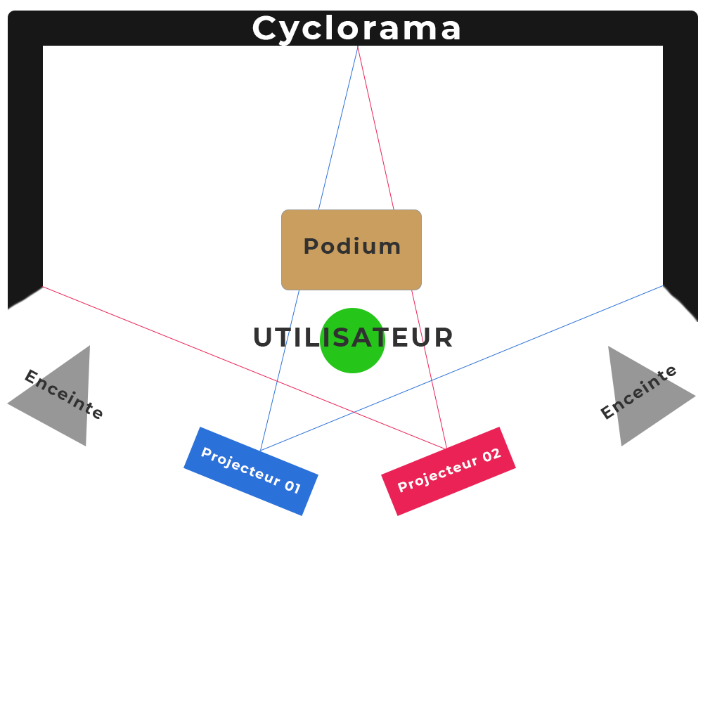

## Titre
Jeu Temporel

### Les créateurs sont 
Raphaël Fillion et Philippe Trudel.

# Les créateurs ont expoité le thème du temps en
créant un quiz qui critique le mode de vie actuelle et qui avertisse le spectateur des conséquences probables ou certaines dans le futur. 

# L'ambiance est
entrainante et amusante, mais devient de plus en plus lourde et conséquente. Plus les mauvaises questions s'accumulent, plus l'ambiance devient désastreuse.

# Voici l'installation en cours dans les studios 

Source : https://tim-montmorency.com/2022/projets/Jeu-Temporel/docs/web/preproduction.html

# Le schéma de l'installation prévue

Source : https://tim-montmorency.com/2022/projets/Jeu-Temporel/docs/web/preproduction.html

# Ce qui est prévu du téléspectateur est
qu'il répond au question posé par l'animateur en appuyant sur les boutons qui son situé sur un boitier. Chaque mauvaise réponse entrainera un mécontantement de l'animateur. 

# 3 cours du programme qui vous semblent incontournables pour avoir les compétences pour créer ce projet
Premièrement, le cour <<Espace Interactif>> a probablement aidé les élèves en ce qui conserne la création de la borne de jeux.
Deuxièmement, le cour <<Intégration Web>> a probablement aidé les élèves en ce qui concerne le CSS.
Troisièmement, le cour <<Introduction à la programmation multimédia>> a probablement aidé les élèves en ce qui concerne le JAVA Script.   

    
