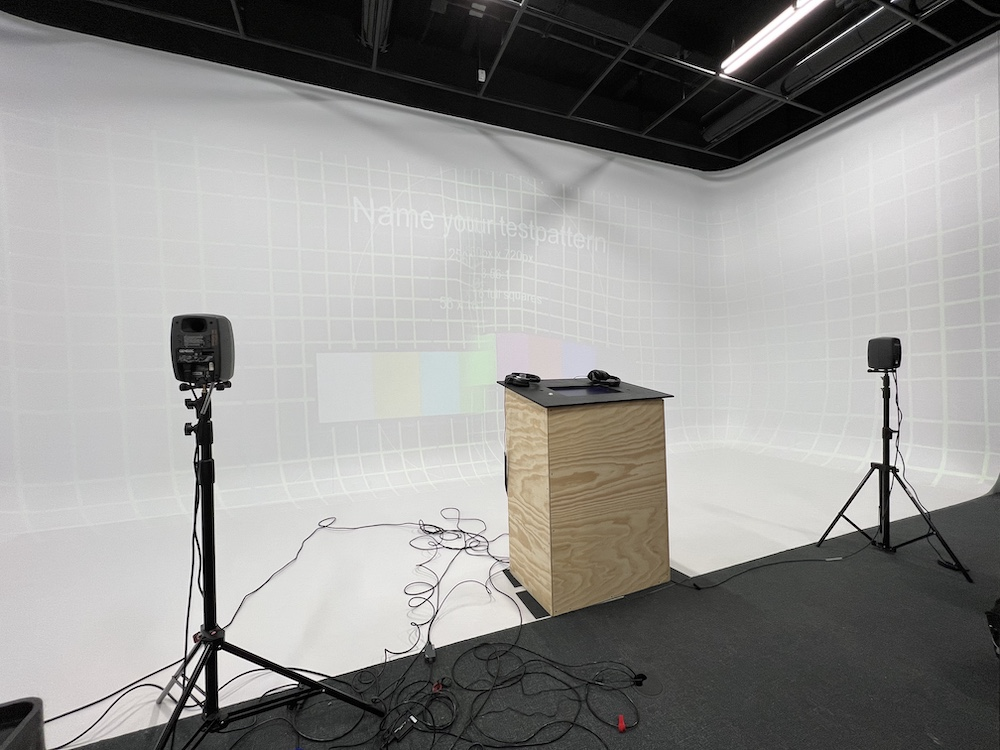
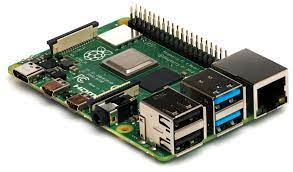

# Une technique qui sera utilisée dans l'une des oeuvres et que vous ne connaissiez pas
Dans le *jeu temporel*, nous avons aprit qu'il faut utiliser des logiciel pour afficher correctement l'image sur le cyclorama. En effet, si on ne fait qu'afficher l'image sur le mure sans utiliser une application pour corriger la projection, l'image sera croche et déformer. Les créateur de *jeu temporel* utilisait l'application Map Mapper pour aficher corrctement le quizz master sur le mur du grand studio.

Exemple d'image déformer sans Map mapping ->

source de l'application : https://madmapper.com/madmapper/software 
# une composante technologique qui sera utilisée dans l'une des oeuvres et que vous ne connaissiez pas
Le raspberry pi est une composante technoloquie que nous ne connaissions pas. Dans *l'horloge de l'apocalypse*, il utilise une kinect pour détecter les mouvement, la kinect est situer dans le plafon sauf qu'il faut que l'ordinatoeur soit proche de la kinect pour que cela fonctionne. Le probème est qu'on ne peut pas placer un ordinateur normal dans le plafon puisque c'est trop gros. La situation au problème est le Raspberry pi puisque c'est un mini ordinatoeur qui est possible de placer dans le plafon pour permettre a la kinect de fonctionner.

Source : https://www.raspberrypi.com/products/raspberry-pi-4-model-b/
